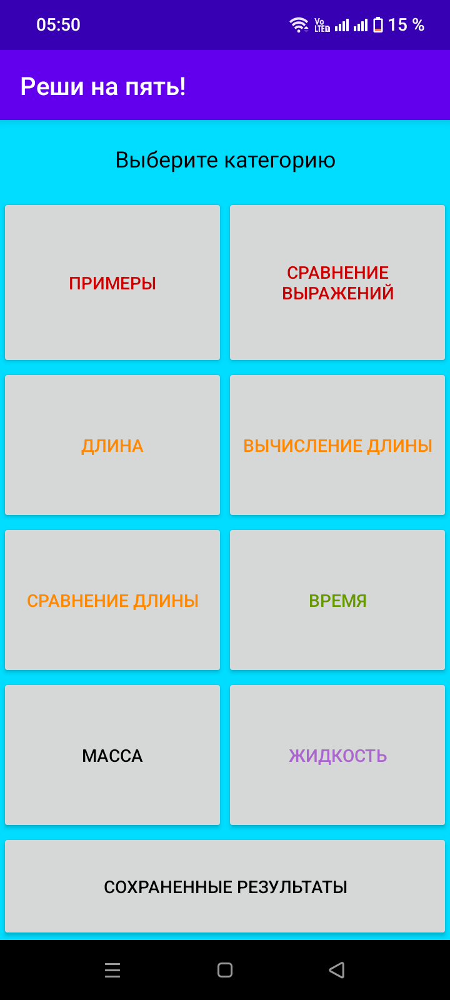
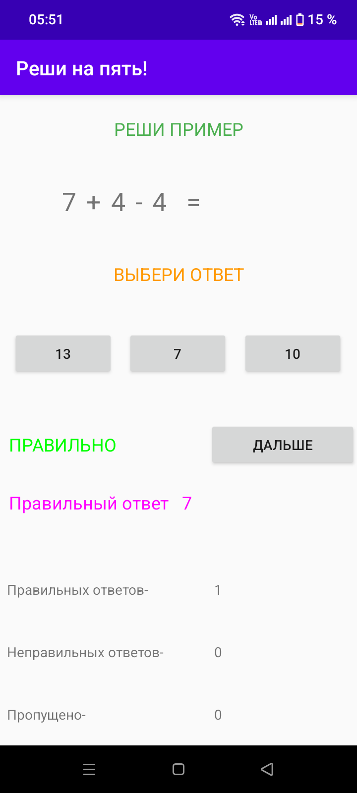
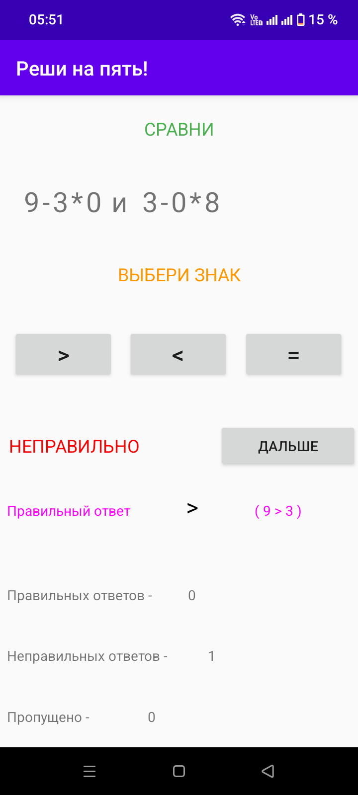
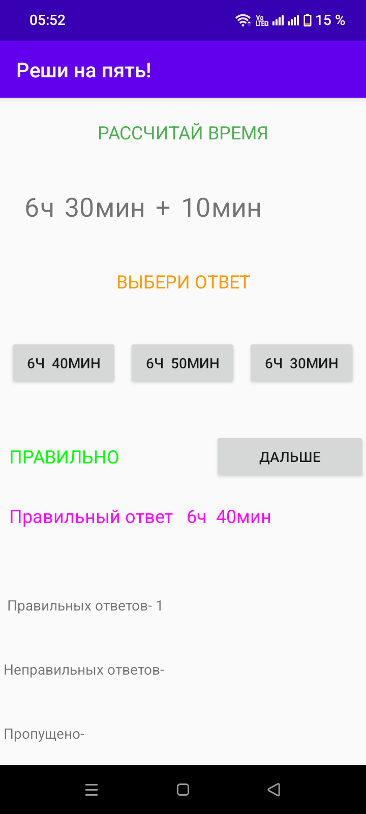
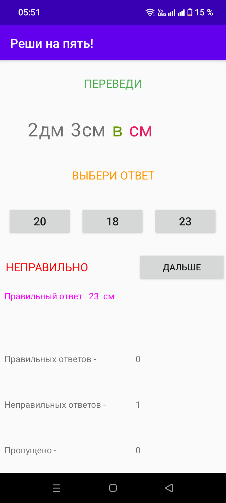
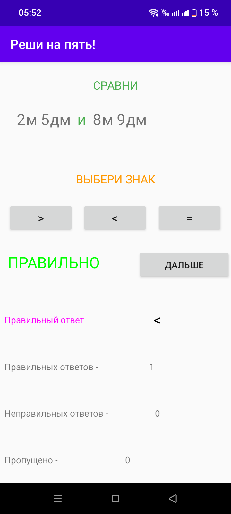
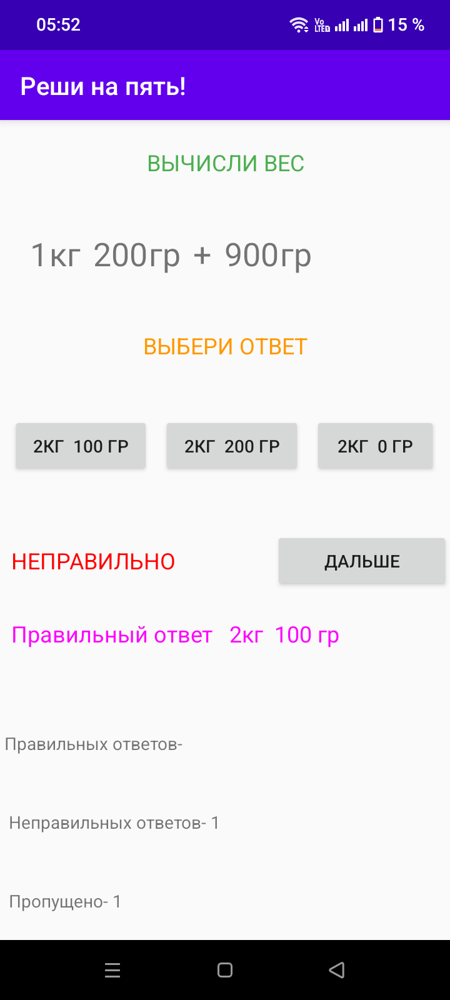
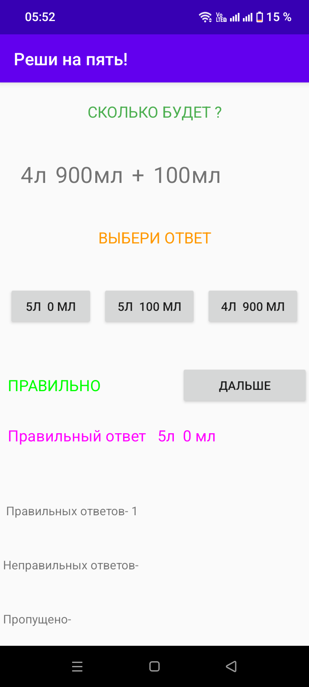
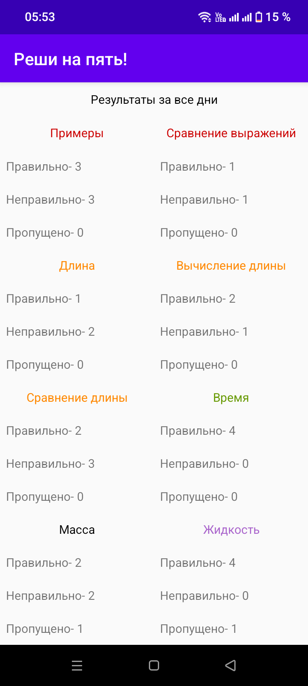

# 🧮 Реши на пять!

---

### 📊 Статус проекта:
✅ **Полный функционал** — тренажёр по математике работает  
✅ **8 категорий заданий** — примеры, сравнения, длина, время, масса, жидкость и др.  
✅ **Сохранение результатов** — статистика по всем дням хранится в приложении  

---

### 🎯 Что сделано:
- Android-приложение-тренажёр по математике для начальной школы
- 8 категорий заданий: примеры, сравнение выражений, длина, вычисление длины, сравнение длины, время, масса, жидкость
- Генерация примеров и задач с вариантами ответов (3 варианта)
- Мгновенная проверка: «ПРАВИЛЬНО» / «НЕПРАВИЛЬНО»
- Показ правильного ответа (в т.ч. с пояснением)
- Статистика: правильные, неправильные, пропущенные
- Экран «Сохранённые результаты» — сводка по всем категориям за все дни
- Кнопка «ДАЛЬШЕ» для перехода к следующему заданию

---

### 🏗 Архитектура проекта

Приложение разделено на **3 логических модуля**:

#### 📚 Выбор категории
Главный экран с плитками категорий: **Примеры**, **Сравнение выражений**, **Длина**, **Вычисление длины**, **Сравнение длины**, **Время**, **Масса**, **Жидкость**, а также кнопка **«Сохранённые результаты»**. Каждая категория выделена своим цветом.

#### ❓ Тренажёр
Экран задания: условие (например, `6ч 30мин + 10мин`, `2дм 3см в см`, `4л 900мл + 100мл`, `2м 5дм и 8м 9дм`), три варианта ответа и кнопка «ДАЛЬШЕ». После выбора:
- выводится вердикт **ПРАВИЛЬНО** (зелёный) или **НЕПРАВИЛЬНО** (красный),
- показывается правильный ответ (иногда с пояснением, например `( 9 > 3 )`),
- обновляются счётчики: правильных / неправильных / пропущенных.

#### 📊 Сохранённые результаты
Сводный экран со статистикой за все дни по каждой категории: правильные, неправильные, пропущенные.

---

### 🛠️ Технологии:

| Компонент | Технологии |
|-----------|------------|
| **Язык** | Java |
| **Платформа** | Android (API 17+) |

---

### 📸 Галерея скриншотов

#### 🏠 Главный экран и тренажёр

👉 Нажмите, чтобы развернуть скриншоты

 

| Выбор категории | Примеры | Сравнение выражений |
| :---: | :---: | :---: |
|  |  |  |
| **Время** | **Вычисление длины** | **Сравнение длины** |
|  |  |  |
| **Масса** | **Жидкость** | **Сохранённые результаты** |
|  |  |  |

---

### 📌 О проекте

> Проект разработан как портфолио-решение для демонстрации навыков разработки под **Android на Java**. Показывает работу с навигацией между Activity, генерацией заданий по категориям, обработкой пользовательского ввода, динамическим обновлением интерфейса, цветовым выделением элементов и сохранением статистики ответов за всё время использования.

---

### 📝 Лицензия

MIT. Свободное использование в образовательных целях.
